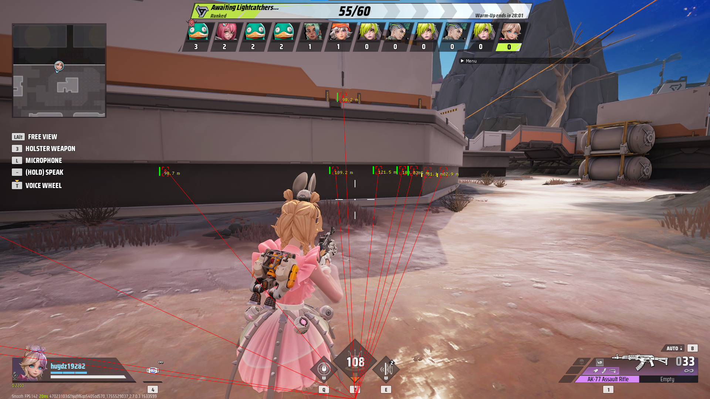
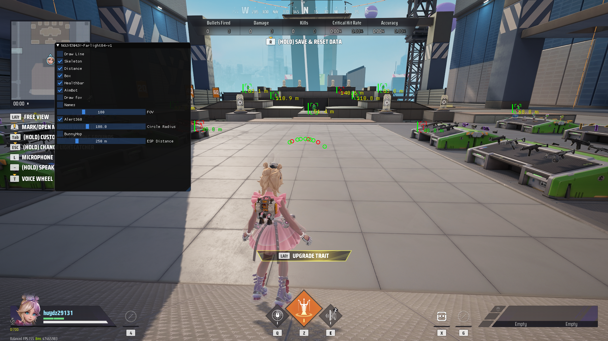
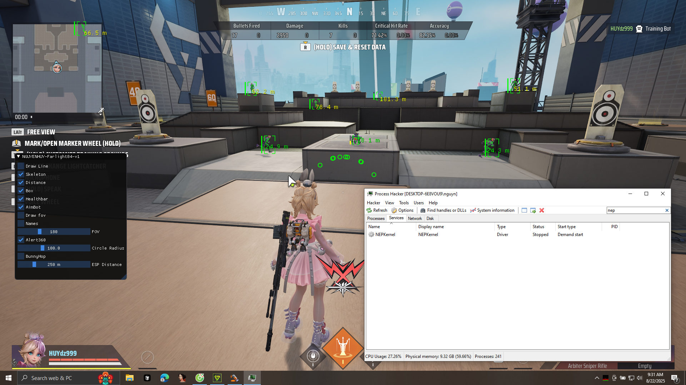
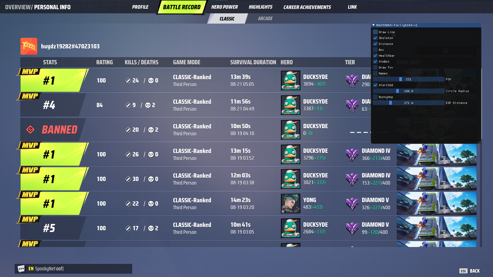

# farlight84-cheat

## Overview
This project is a C++ internal cheat for **Farlight 84** built using DirectX 11 and ImGui.  
It provides an SDK-based framework that makes it easier to implement ESP, aimbot, and other features.

## Demo Video
[Watch Demo on YouTube](https://youtu.be/KOfa24BovX0?si=CRBbmCyu6JpgDxPl)

## Demo Screenshots
Here are some screenshots of the cheat in action:

## Setup
1. Use **Dumper7** to dump the game and generate the latest SDK.
2. Add the generated SDK into the `CppSDK` folder of this project.
3. Build the project in Visual Studio (x64, Release).
4. Inject the compiled DLL into the game.

## Notes
- Always update your SDK after each game update.
- Make sure to use the correct dump generated by **Dumper7**.
- This project is for educational purposes only.

[Forum Reference](https://www.unknowncheats.me/forum/farlight-84-a/714814-farlight84-internal-update.html)
